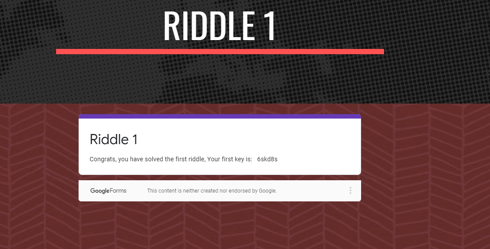
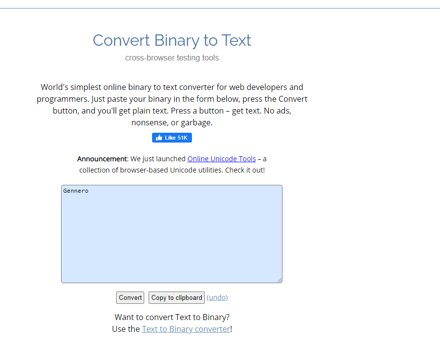
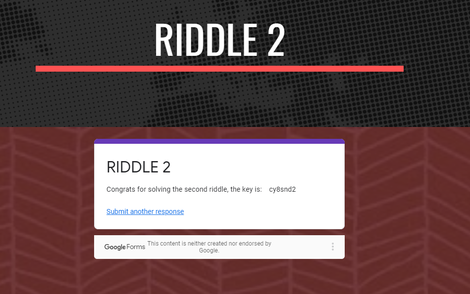
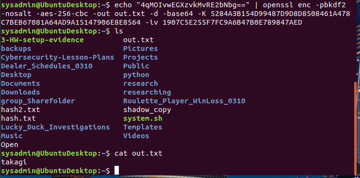
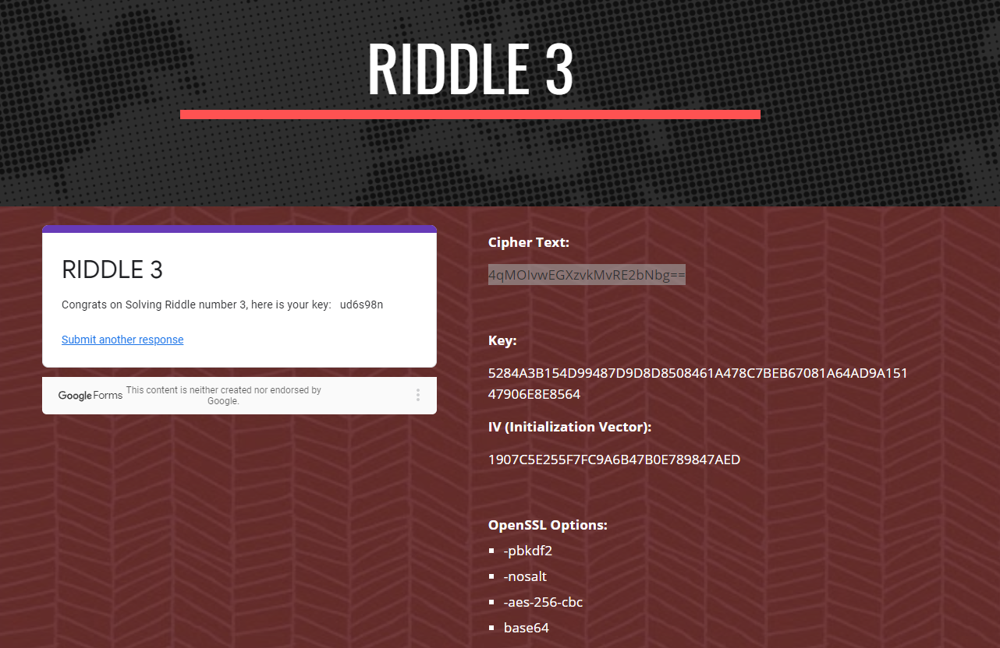
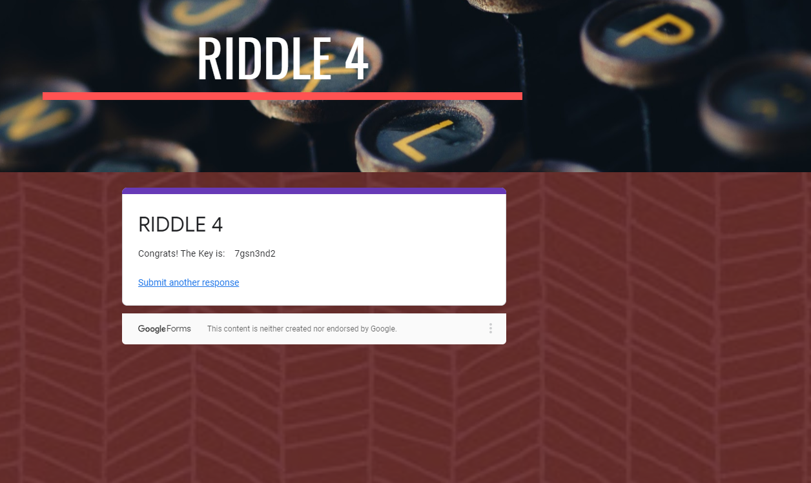
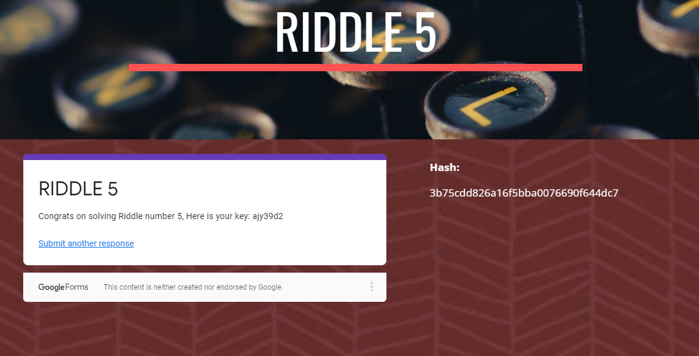
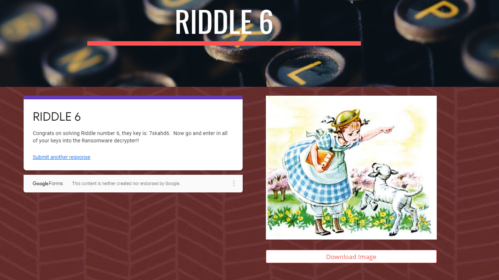
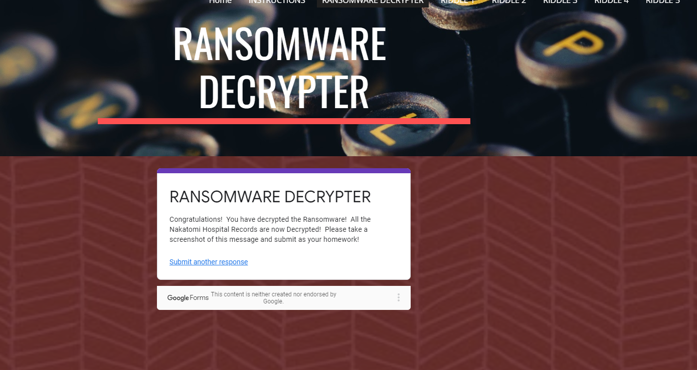

Ransomware Riddles

Background
In this homework assignment, you will play the role of a cybersecurity analyst at Nakatomi Hospital.

Unfortunately, one of the hospital's doctors opened up an email containing ransomware.

This ransomware spread throughout the hospital and encrypted all of the Patient Records.

The ransomware has given you two options to decrypt and retrieve the patient records: Either pay 100 bitcoins or solve six riddles.

Since you refuse to pay off any ransom, you'll have to solve six cryptographic riddles. Act fast: the doctors need to access the patient records as lives are at stake!

Additionally, a Career Service Milestone is located at the end of this file. Complete it to learn how to become more Employer Ready.

Topics Covered in Your Assignments

Encryption
Decryption
Caesar Cipher
Encoding and Decoding
Binary
Symmetric and Asymmetric Encryption
Open SSL
Key/IV
Public/Private Keys
Key Distribution
Hashing
Hashing Algorithms
Hashcat
Steganography
Steghide

### Files Required
The entire homework assignment can be completed on a publicly available website linked below. If for any reason, the website has issues or is unavailable, an offline copy has also been provided.

Website: https://sites.google.com/view/cryptobreakout/

Offline Copy: Crypto_Homework

## Instructions:

In order to solve each riddle, you will need to apply cryptographic concepts covered in the past three lessons.
concepts will need to be applied.
Once the riddle has been solved, submit your answer on the bottom of each Riddle Page.
If you are correct, you will receive a key. Save this key in your notes.
Once you have collected all six keys, select the Ransomware Decrypted header on the website and enter all your keys.
If all the six keys are correct, the ransomware will be removed and the data will be decrypted.

You will need to submit a screenshot as proof that the ransom
Good luck and act fast as the Nakatomi Patients are counting on you!

## Riddle 1

I used  Caesar Cipher with a shift value of 8
I was giving  (ozcjmz)
after i cipher all the words my result turn out to be (gruber)
after i solved my cipher, i answer the Riddle. 
and my riddle one key is (6skd8s)

- **

## Riddle 2

My riddle two, i used Solution binary 
I was giving (01000111 01100101 01101110 01101110 01100101 01110010 01101111)
My Output answer give me (Gennero)
After i get my answer, i solved my riddle and get the Key  (cy8snd2)

- **

- **

## Riddle 3

My third Riddle was little pit tricky, so i used my abunto machine linex and i used this command: 
*echo "4qMOIvwEGXzvkMvRE2bNbg==" | openssl enc -pbkdf2 -nosalt -aes-256-cbc -out out.txt -d -base64 -K 5284A3B154D99487D9D8D8508461A478C7BEB67081A64AD9A15147906E8E8564 -iv 1907C5E255F7FC9A6B47B0E789847AED*
after i decipher  4qMOIvwEGXzvkMvRE2bNbg==
i got my answer for my Riddle 3 (takagi)
after i answer my riddle, i got my Key  (ud6s98n)

- **

- **

## Riddle 4

my Riddle four was easy, all i had to do was answer questions. 
here is my all answers.

*Jill's public key*
*Jill's private key*
*12 Asymmetric and 15 Symmetric*
*Alice's public key*
after i asnwer correctly i get my key (7gsn3nd2)

- **

## Riddle 5

My riddle five was little hard to solve. I used my abunto machine linex and i used this command:
 *hashcat -m 0 temp rockyou.txt*
my riddle give me this hash to solve (3b75cdd826a16f5bba0076690f644dc7)
after i decipher, i got my answer (argyle)
after i answer my riddle five, i got my Key (ajy39d2)

- **

## Riddle 6

My riddle six was little tracky, but i also used my abunto machine linex.
i used this command: 
*steghide extract -sf mary-lamb.jpg ; #pass : ABC ;*
after i sued the command, i got my riddle six answer (mcclane)
i answer my final riddle and i got the Key  (7skahd6)

- **

## Ransomware Decrypted

After i got all  six cryptographic riddles, i went back to Decrypted header on the website and enter all six keys i solved.
and here is my screenshot result.

- **
